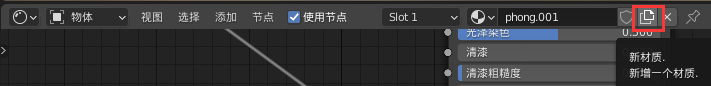

### 本节课目的

一方面，本节课主要给大家说下，在没有写代码之前，怎么借助一些工具，预览gltf格式模型。

另一方面想让程序员体验下三维建模软件预览产品3D模型的感觉，在不写代码情况下，程序员也能预览美术导出的模型是什么样子。

### 预览三维模型工具

专业三维建模软件：**3dmax**、**blender**、**c4d**、**maya**等等

模型预览小工具
1. **gltf-viewer**：https://gltf-viewer.donmccurdy.com/
2. **three.js editor**:https://threejs.org/editor/
3. **vscode**预览gltf模型：vscode搜索gltf，可以看到glTF Tools的工具

没有写代码之前，作为程序员，如果你会使用某款三维建模软件，可以直接使用该建模软件预览美术给你的产品模型，如果没有相关使用经验，可以选择三维软件**blender**。

一些模型预览小工具一般功能比较简单，如果后期工作需要程序员或美术更改一些模型细节，比如模型名称，往往不支持或使用不方便，所以程序员可以考虑使用3D建模软件预览3d模型，从安装、导出gltf格式方便程度来看，可以考虑选择blender。

### Blender预览3D模型演示

通过Blender可以**导入**、**导出**和**预览**产品的3D模型，你可以跟着视频的操作体验下，这样也算是培养一点3D模型软件的操作经验。

如果你们公司3D美术熟悉Blender，遇到问题直接询问美术就是最好的方式，如果3D美术不了解，可以一块去了解，毕竟3D美术有其它三维软件的操作基础，上手Blender速度要比大部分程序员快得多。

### blender导入

文件——导入：支持gltf、obj、fbx、stl等多种常用格式

### Bledner鼠标操作

缩放：鼠标中键滚动

旋转：鼠标中键拖动

### blender材质相关操作指南

- 预览和设置材质效果：顶部菜单**shading**选项

- **新建材质**：

- 查看**材质属性**信息：鼠标中键拖动平移，中键滚动缩放

- 设置**颜色贴图**：添加——纹理——图像纹理

- 设置**Aplpha贴图**：添加——纹理——图像纹理或者复制颜色贴图对象，然后更换贴图即可
  
- **法线贴图**：1. 复制颜色贴图 2.添加——矢量——法线贴图

添加——纹理——环境纹理
  

